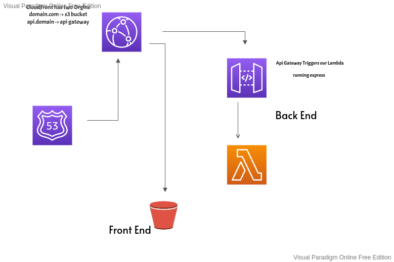

# fullstack_serverless
This is a fully automated serverless deployment system

## Infrastructure(IAC)
SLS is a IaC framework and will provison all the infrastructure thats needed for running a fullstack serverless project.



## Getting Started
To get started you will need a few things.
1. npm install -g serverless
2. AWS CLIv2 [install](https://docs.aws.amazon.com/cli/latest/userguide/install-cliv2-linux.html#cliv2-linux-install)

3. Run ```aws configure``` and enter in your aws id/key/region/ouput format
4. Set your enviroment variables for your project.

     ```
        export PROJECT_NAME=fullstack-serverless //this is what sls will name your AWS resources.
        export CLIENT_URL=dustingserver.link // this is the endpoint to your frontend and api.

      ``` 
## Make your first deployment
You should be ready to make a deployment by going into the backend directory and running ```./deploy.sh``` 


